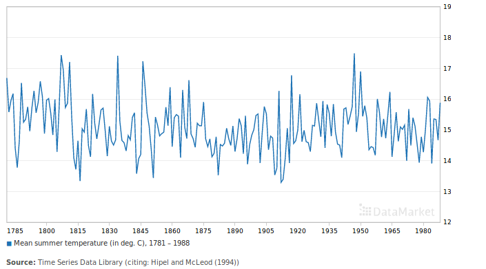
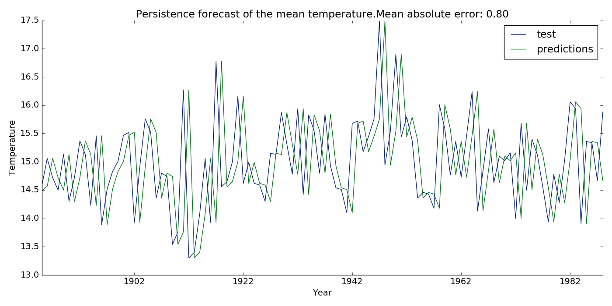

# Machine Learning

The goal of this repository is to showcase some machine learning applications.
The main focus will be time series forecasting using Python3.

Acknowledgements: I would like to thank Jason Brownlee for his machine learning
tutorials on [machinelearningmastery](https://machinelearningmastery.com/).

## Dataset

The dataset that is going to be used is [Mean summer temperature (in deg. C),
1781-1988]
(https://datamarket.com/data/set/22m7/mean-summer-temperature-in-deg-c-1781-1988#!ds=22m7&display=line).
I found it in the [Time Series Data Library](https://datamarket.com/data/list/?q=provider:tsdl),
a compilation of time series made by Rob Hyndman, Professor of Statistics at
Monash University, Australia.

This is what the dataset looks like:



This dataset only contains 208 values but I've chosen to use it because a simple
example will be easier to understand.

## Loading the dataset

The data is going to be formatted in a pandas dataframe.
[Pandas](https://pandas.pydata.org/) is a powerful library that contains an
incredible amount of built-in functions.
In order to be able to use it on a Debian-based distribution, one needs to run 
`apt-get install python3-pandas`.

The dataset is saved inside a `.csv`, which means that it is possible to load it
using the `read_csv` function.
The code is the following:

```python
import pandas as pd

def parser(date):
    """ Takes a year as a parameter and returns a datetime """
    
    return pd.datetime.strptime(date, '%Y')

dataframe = pd.read_csv(
    DATASETS_DIR + mean_summer,  # where the dataset file is
    names=['Year', 'Temperature'],  # column names
    index_col=0,  # column to be used as index - 'year' in this case
    skiprows=[0, 210], # skip column names, and the dataset's name
    parse_dates=[0],  # parse first column into dates
    date_parser=parser  # function used to parse dates
)
```

Some lines need to be removed, which is why the `skiprows` paremeter is used.
Aside from that, it us useful to parse dates into a `pandas.Datetime` object to
be able to perform operations on dates.

## Experimental Setup

The dataset will be separated into two parts: the *training* set, and the
*test* set.
In this example, the *training* set will be the first half of the dataset,
and the *test* set will be the second half.
This choice is somewhat arbitrary and could be changed to add a *validation*
set in which parameters would be changed in order to optimize results.

the [sklearn](http://scikit-learn.org/stable/) library can be used to determine
how well our classifier performed with the use of several 
[metrics](http://scikit-learn.org/stable/modules/model_evaluation.html#regression-metrics).
In this particular example, regression metrics have to be used in order to
measure regression performance.
Here, the [mean absolute error](http://scikit-learn.org/stable/modules/generated/sklearn.metrics.mean_absolute_error.html#sklearn.metrics.mean_absolute_error)
is going to be used.

## Different Forecasting Methods

### Persistence Forecast

This method can be best summarized with 'today equals tomorrow'.
It means that the value `i+1` is expected to have the same value as `i`.

In order to do so, one needs to implement something close to the following
code:

```python
# Last value that has been observed. It is initialized to the last value of
# the training set because the first value of the test set will be equal to
# the last value of the training set.
last_value = training.iloc[-1]

# List that will contain a prediction for every value in test
predictions = pd.DataFrame(columns=['Temperature'])

# For each value in the training set
for index, value in test.iterrows():
    # Append our prediction to the 'predictions' list
    predictions.loc[index] = last_value

    # Modify the last value to be the current one
    last_value = value

# Compute mean absolute error
error = mean_absolute_error(test, predictions)

# Plot of the difference
plt.plot(test, label='test')
plt.plot(predictions, label='predictions')
```

**Note:** The entire code is available in the file 
[machine_learning.py](machine_learning.py).

Generated figure:



As expected, such a naive forecast does not yield good results.
However, it is a good baseline to compare different methods.